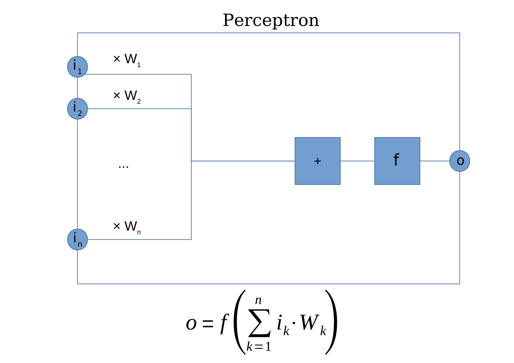

# Perceptron

## Introduction

The perceptron is one of the simplest forms of artificial neural networks and serves as the foundation for more complex models. In this README, we provide an overview of the perceptron, including its mathematical background, algorithm, advantages, disadvantages, and applications.

## Mathematical Background

The perceptron is a binary classification algorithm that takes an input vector $\mathbf{x}$ and computes a weighted sum of its elements, followed by a threshold activation function. Mathematically, the output $y$ of a perceptron is given by:

$$
y = 
\begin{cases}
1, & \text{if } \mathbf{w} \cdot \mathbf{x} + b > 0 \\
0, & \text{otherwise}
\end{cases}
$$

where:
- $\mathbf{w}$ is the weight vector.
- $\mathbf{x}$ is the input vector.
- $b$ is the bias term.
- $\cdot$ denotes the dot product.

The perceptron learns to adjust its weights and bias to correctly classify input vectors based on training data.

The training process involves finding the optimal weights and bias that minimize the classification error. This is typically achieved through an iterative optimization algorithm called gradient descent. The perceptron update rule for adjusting the weights $\mathbf{w}$ is given by:

$$
\mathbf{w} = \mathbf{w} + \alpha \cdot (y - \hat{y}) \cdot \mathbf{x}
$$

where $\alpha$ is the learning rate, $y$ is the true label, and $\hat{y}$ is the predicted label.

## Algorithm

The perceptron learning algorithm adjusts the weights and bias incrementally to minimize the classification error. It follows these steps:

1. Initialize weights $\mathbf{w}$ and bias $b$ to small random values.
2. For each input vector $\mathbf{x}$ in the training dataset:
   - Compute the predicted output $\hat{y}$ using the current weights and bias.
   - Update weights and bias based on the error between predicted and actual output.
3. Repeat step 2 until convergence or a maximum number of iterations.

## Advantages and Disadvantages

### Advantages

1. **Simple**: The perceptron is easy to understand and implement, making it suitable for beginners in neural network modeling.
2. **Fast Training**: With its simple learning rule, the perceptron can converge quickly on linearly separable datasets.
3. **Efficient for Binary Classification**: It performs well for binary classification tasks when the classes are linearly separable.

### Disadvantages

1. **Limited to Linear Separability**: The perceptron cannot learn non-linear decision boundaries, limiting its applicability to linearly separable datasets.
2. **Sensitivity to Initialization**: The performance of the perceptron can be sensitive to the initial weights and biases, leading to suboptimal solutions.
3. **Lacks Hidden Layers**: Perceptrons do not have hidden layers, restricting their ability to model complex relationships in data.

## Applications

1. **Pattern Recognition**: Perceptrons are used for simple pattern recognition tasks, such as optical character recognition and image classification.
2. **Signal Processing**: They are employed in signal processing applications, including noise reduction and signal classification.
3. **Cybersecurity**: Perceptrons can be utilized for intrusion detection and malware detection in cybersecurity systems.

 